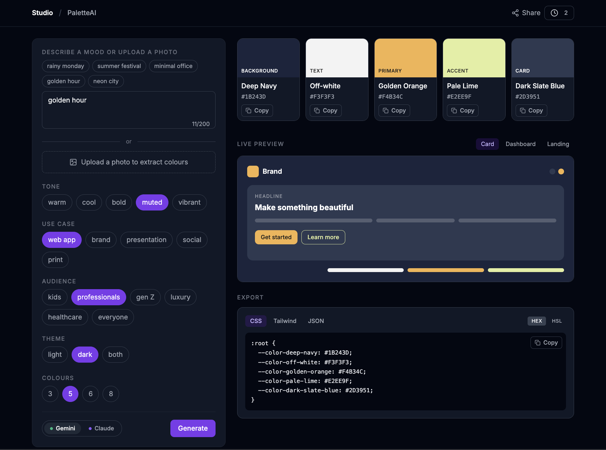

# PaletteAI

**Describe a mood. Upload a photo. Get a colour palette.**

A production-grade AI tool that generates design-ready colour palettes from natural language or images. Built to demonstrate real-world AI integration, TypeScript architecture, and product thinking.

🔗 **Live:** [studio-palette-ai.vercel.app](https://studio-palette-ai.vercel.app)
🏠 **Studio:** [studio-root.vercel.app](https://studio-root.vercel.app)

---



---

## Features

- **Text-to-palette** — describe a mood, tone, use case, audience, and theme; receive 3–8 named, hex-accurate colours with usage roles and rationale
- **Image-to-palette** — upload a photo (JPEG/PNG/WEBP); Claude or Gemini vision extracts a matching palette directly from the image
- **Dual AI providers** — switch between Claude (Haiku) and Gemini (2.5 Flash) via a model toggle; both support text and image generation
- **Shareable URLs** — every palette encodes as base64 in the URL hash; paste the link anywhere to restore the exact palette with no API call
- **Live preview** — see colours applied to a fake app UI (card / dashboard / landing layouts) in real time
- **Export panel** — copy as CSS custom properties, Tailwind config, or raw JSON
- **History drawer** — last 20 palettes persisted in localStorage with model badge and relative timestamps
- **Rate limiting** — per-IP 10 s cooldown + 100 req/day global cap; client countdown button mirrors server state

---

## Tech Stack

| Layer | Choice | Why |
|---|---|---|
| Framework | Next.js 14 App Router | Server components, API routes, SSR with client hydration |
| Language | TypeScript (`strict: true`) | End-to-end type safety; no `any` anywhere |
| Styling | Tailwind CSS | Utility-first; dark mode via `dark:` variants throughout |
| AI — text | Anthropic `claude-haiku-4-5-20251001` | Fast, cheap, reliable JSON output |
| AI — text | Google `gemini-2.5-flash` | Free tier 1 500 req/day; default provider |
| AI — vision | Anthropic + Google vision APIs | Same models, image content blocks / inlineData |
| Monorepo | pnpm workspaces + Turborepo | Shared packages, independent deployments, fast builds |
| Deployment | Vercel | Per-app projects, automatic deploys from `main` |

---

## Architecture

### Monorepo structure

```
studio/
├── apps/
│   ├── palette-ai/          ← this app
│   └── root/                ← showcase landing site
└── packages/
    ├── ai-core/             ← AI providers + rate limiter (server-only)
    ├── ui/                  ← shared React components
    ├── utils/               ← pure utility functions (client + server safe)
    └── tailwind-config/     ← base Tailwind config
```

PaletteAI imports from shared packages but is independently deployable. No app imports from another app.

### AI provider Strategy pattern

Both text and image generation use the Strategy pattern. Adding a third provider (e.g. OpenAI) requires one new file and one branch in the router — nothing else changes.

**Text generation:**
```
POST /api/generate
  └── generatePalette(options)
        ├── buildPrompt(options)          ← constructs the structured prompt
        ├── claudeProvider(prompt)        ← Anthropic SDK
        │   or geminiProvider(prompt)     ← Google GenAI SDK
        └── parseColours(raw, count)      ← validates + types the JSON response
```

**Image generation:**
```
POST /api/generate-from-image
  └── routes on model field
        ├── claudeVisionProvider(prompt, imageBase64, mimeType)
        │     └── messages.create with image content block
        ├── geminiVisionProvider(prompt, imageBase64, mimeType)
        │     └── generateContent with inlineData block
        └── parseColours(raw, count)      ← same parser, unchanged
```

Both routes share the same structure: rate limit → validate → provider → parse → retry once on `PARSE_FAILED` → respond.

### API key isolation

AI SDKs (`@anthropic-ai/sdk`, `@google/generative-ai`) are imported exclusively inside `packages/ai-core/src/` and `app/api/*/route.ts` files. They are never imported in components, hooks, or any file that might reach the browser. TypeScript path aliases enforce this at compile time.

### Shareable URL state

Palettes are serialised to the URL hash with no server involvement:

```ts
// encode: TextEncoder → btoa (Unicode-safe, handles AI-generated smart quotes/em dashes)
window.location.hash = encodeState(palette);

// decode: atob → TextDecoder, falls back to legacy plain-atob for old URLs
const restored = decodeState<Palette>(hash);
```

`encodeState` / `decodeState` live in `@studio/utils` (safe on client and server). The mount effect and a `hashchange` listener keep the palette in sync with the address bar — pasting a URL in the same tab switches the palette without a reload.

### Image upload flow

The image is converted to base64 in the browser (`FileReader`), sent in the request body, and validated server-side (MIME type, 5 MB max). The route calls the vision provider with a structured extraction prompt and parses the response with the same `parseColours` function used for text generation.

```ts
// Client (MoodInput.tsx)
const dataUrl = reader.result as string;               // "data:image/jpeg;base64,..."
const [meta, imageBase64] = dataUrl.split(",");
const mimeType = meta.split(":")[1].split(";")[0];

// Server (route.ts)
const visionProvider: VisionProviderFn =
  model === "claude" ? claudeVisionProvider : geminiVisionProvider;
const raw = await visionProvider(prompt, imageBase64, mimeType);
const colours = parseColours(raw, count);
```

### Rate limiting

Three-layer defence:
1. **Anthropic dashboard** — hard $5/month spend cap (zero code)
2. **In-memory Map** — per-IP 10 s cooldown + 100 req/day global cap (server)
3. **Client countdown** — Generate button shows remaining seconds (UX signal, not security)

The in-memory Map resets on Vercel cold starts, which is acceptable for portfolio traffic. The Anthropic cap is the real safety net.

---

## Key Engineering Decisions

**Why two AI providers?**
Gemini's free tier handles most traffic, preserving Anthropic credits. The strategy pattern means users can switch with one click and the architecture doesn't care which provider responds.

**Why URL hash state instead of a database?**
Zero infrastructure, zero auth, fully stateless. A shared URL works immediately in any browser with no backend round-trip. localStorage handles history; the hash handles sharing.

**Why `TextEncoder`/`TextDecoder` for base64?**
`btoa(JSON.stringify(...))` throws for characters above U+00FF. AI models regularly produce smart quotes (`'` `"`) and em dashes (`—`) in colour names and rationales. The TextEncoder path converts to UTF-8 bytes first, making encoding reliable for any Unicode content. A fallback path decodes legacy plain-`btoa` URLs for backwards compatibility.

**Why `<div role="button">` on SwatchCard?**
`SwatchCard` contains a `CopyButton` (`<button>`). Nesting `<button>` inside `<button>` is invalid HTML — browsers silently remove the inner element, causing a React hydration mismatch on every render. Converting the outer element to a `<div role="button">` with keyboard handlers resolves the structural issue while keeping full accessibility.

---

## Roadmap

### ✅ Phase 1 — Core (shipped)
- Text-to-palette via Claude and Gemini
- Tone, use case, audience, theme, and count selectors
- Swatch display with WCAG contrast badges and HSL detail panel
- Live preview across card / dashboard / landing layouts
- CSS, Tailwind, and JSON export
- Palette history in localStorage

### ✅ Phase 2 — Sharing and vision (shipped)
- Shareable URLs via base64-encoded URL hash
- Image-to-palette via Claude and Gemini vision APIs
- Share button with "Link copied!" toast
- History palettes restore from URL with no API call

### 🔜 Phase 3 — Refinement and comparison (planned)
- **Refinement chips** — "make it darker", "increase contrast", "add warmth"; re-calls the API with the existing palette appended to the prompt
- **Figma export** — copy palette as a Figma-ready JSON plugin payload
- **Upstash Redis rate limiter** — replace in-memory Map so limits survive Vercel cold starts

### 💡 Future ideas
- Public palette gallery — opt-in sharing with a short slug URL
- Colour lock — pin one colour and regenerate the rest around it
- Accessibility report — full WCAG AA/AAA matrix across all colour pairs in the palette
- Additional providers — OpenAI GPT-4o vision, Stability AI colour extraction

---

## Local Development

```bash
# Prerequisites: Node 18+, pnpm 9+

git clone https://github.com/arunsmn/studio.git
cd studio
pnpm install

# Add API keys
cp .env.example .env.local
# Fill in ANTHROPIC_API_KEY and GEMINI_API_KEY

# Run PaletteAI
pnpm dev --filter=@studio/palette-ai
# → http://localhost:3001

# Run tests
pnpm test --filter=@studio/palette-ai   # 69 unit tests

# Build check
pnpm build --filter=@studio/palette-ai
```

---

## Project Structure

```
apps/palette-ai/
├── app/
│   ├── page.tsx                    ← main page, state wiring
│   ├── globals.css
│   └── api/
│       ├── generate/route.ts       ← text generation endpoint
│       └── generate-from-image/    ← vision endpoint
│           └── route.ts
├── components/
│   ├── MoodInput.tsx               ← text input + image upload UI
│   ├── SwatchGrid.tsx              ← responsive palette display
│   ├── SwatchCard.tsx              ← individual colour card
│   ├── DetailPanel.tsx             ← HSL, contrast ratio, WCAG badges
│   ├── BannerStrip.tsx             ← expandable colour strip
│   ├── LivePreview.tsx             ← fake app UI using palette colours
│   ├── ExportPanel.tsx             ← CSS / Tailwind / JSON export
│   ├── HistoryDrawer.tsx           ← slide-in palette history
│   └── ShareToast.tsx              ← "Link copied!" toast
├── hooks/
│   ├── usePalette.ts               ← fetch wrapper, loading/error/cooldown state
│   └── useHistory.ts               ← localStorage history management
├── lib/
│   ├── types.ts                    ← Colour, Palette, PaletteOptions
│   ├── buildPrompt.ts              ← structured prompt construction
│   ├── parseColours.ts             ← response parser + validator
│   └── providers/
│       └── index.ts                ← generatePalette() strategy router
└── __tests__/                      ← 69 Vitest unit tests
    ├── parseColours.test.ts
    ├── buildPrompt.test.ts
    ├── generatePalette.test.ts
    ├── colourUtils.test.ts
    └── urlState.test.ts
```
